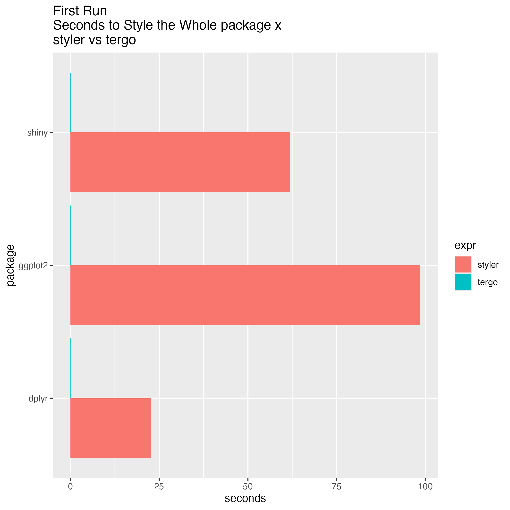

# `tergo`

## Why `tergo`?

There is plenty of formatting libraries for R. Just to name a few:

- [`styleR`](https://github.com/r-lib/styler)
- [`formatR`](https://github.com/yihui/formatR/tree/master)

Unfortunately, all of them suffer from one major drawback. They are slow.
If you care about speed and efficiency of your styling tool, and not so much
about the full-blown configurability, you should use `tergo`. Some
use-cases include:

- Save money on your CI infrastructure by checking the style with `tergo`
instead of slow running alternatives. Save tens of hours on your monthly bill!
- You are developing a user interface that needs to style the code for
the user to see and other styling libraries don't cut it in terms of speed
and efficiency.

`tergo` is **Faster than Blink of an Eye**. First run is more **x100 faster** or for bigger repositories even **x1000 faster** than other available solutions.



Yes, tergo is there but it takes less than 0.1 seconds so is not visible!!!

Benchmarking code is available in `inst/bench.R`.

## Installation

### From Github sources

Requires [Rust tooling](https://www.rust-lang.org/tools/install):

- `rustup`
- `cargo`

```R
if (!require(remotes)) {
  install.packages("remotes")
}
remotes::install_github("kpagacz/tergo@latest", subdir = "antidotum/tergo")
```

### From R-Universe

Does not require Rust tooling, because R-Universe builds binaries.

```R
install.packages('tergo', repos = c('https://kpagacz.r-universe.dev', 'https://cloud.r-project.org'))
```

## Usage

See the [R manual](rtergo.pagacz.io) for the reference.

To style your package, run:

```R
tergo::style()
```

## Configuration

### TOML file

`tergo` reads the configuration from a TOML file (`tergo.toml`) in your package root.
See [the library documentation for possible values and their
explanation](https://docs.rs/tergo-lib/latest/tergo_lib/struct.Config.html).

### As an argument to styling functions

The styling functions accept a configuration argument that lets
you modify the styling behaviour without a configuration file.

The keys and the possible values are the same as in the TOML file.
See [the library documentation for possible values and their
explanation](https://docs.rs/tergo-lib/latest/tergo_lib/struct.Config.html).
